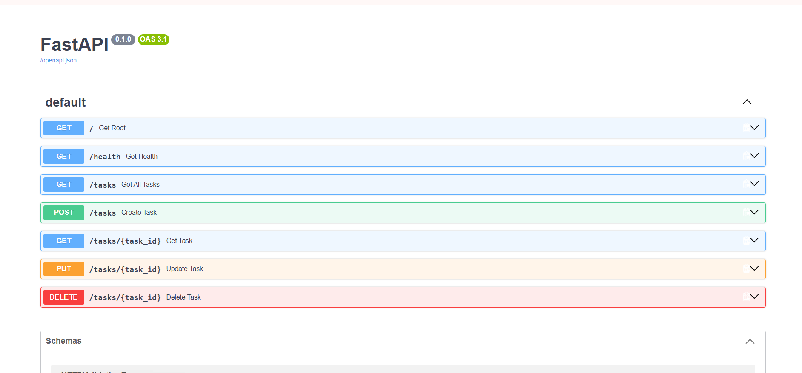
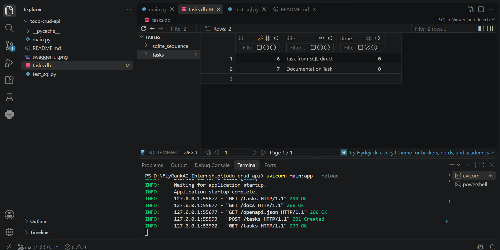

# FastAPI To-Do CRUD API (In-Memory to SQLite Migration)

A persistent, production-ready RESTful Task Management API built with Python, FastAPI, and SQLite. Originally developed as an in-memory prototype, this project demonstrates the architectural evolution from ephemeral RAM storage to disk-persisted relational database management using raw SQL.

---

## 🛠️ Tech Stack
* **Framework:** FastAPI
* **Web Server:** Uvicorn (ASGI)
* **Data Validation & Serialization:** Pydantic
* **Persistence Layer:** SQLite (`tasks.db`) via Python's built-in `sqlite3`
* **Lifecycle Management:** Python `@asynccontextmanager` Lifespan Protocol

---

## 📌 Architectural Evolution: In-Memory vs SQLite

### 1. Stage 1 (In-Memory Prototype)
* **Storage:** Python heap memory (`list` of dictionaries).
* **The Mortality Experiment:** Restarting the Uvicorn server cleared runtime RAM, resetting tasks back to the default seed list. This demonstrated the need for durable persistence.

### 2. Stage 2 (SQLite Database Persistence)
* **Why SQLite?**
  * **Zero Configuration:** Serverless architecture requiring no external daemon or background service.
  * **Single-File Portability:** All relational data, indexes, and schema definitions live entirely within `tasks.db`.
  * **ACID Compliant:** Supports transactional integrity and standard SQL operations (`SELECT`, `INSERT`, `UPDATE`, `DELETE`).
* **Storage Location:** Stored at the project root (`tasks.db`).
* **Auto-Initialization:** Handled via FastAPI's asynchronous `lifespan` handler. On the very first server boot, it automatically defines the table schema and seeds initial records if the database is unpopulated.

---

## 🚀 How to Run Locally

1. **Clone the repository:**
   ```bash
   git clone <YOUR-GITHUB-REPO-URL>
   cd todo-crud-api

## Set up a Virtual Environment:
python -m venv .venv
# Windows:
.venv\Scripts\activate
# Mac/Linux:
source .venv/bin/activate

## Install dependencies:
pip install fastapi uvicorn

## Start the development server:
uvicorn main:app --reload

## Access Endpoints:
Root API: http://127.0.0.1:8000/

Health Check: http://127.0.0.1:8000/health

Interactive Swagger UI: http://127.0.0.1:8000/docs

## 📋 API Endpoints Specification

| Method | Endpoint | Description | Implementation Detail | Success Status | Error Codes |
| :--- | :--- | :--- | :--- | :--- | :--- |
| **GET** | `/` | Root API Metadata | Returns service status & message | `200 OK` | — |
| **GET** | `/health` | Health Check | System diagnostic check | `200 OK` | — |
| **GET** | `/tasks` | List all tasks | `SELECT * FROM tasks` | `200 OK` | — |
| **GET** | `/tasks/{id}` | Retrieve specific task | `SELECT * FROM tasks WHERE id = ?` | `200 OK` | `404 Not Found` |
| **POST** | `/tasks` | Create a new task | `INSERT INTO tasks (title, done) VALUES (?, 0)` | `201 Created` | `400 Bad Request` |
| **PUT** | `/tasks/{id}` | Update task details/status | `UPDATE tasks SET title = ?, done = ? WHERE id = ?` | `200 OK` | `400 Bad Request`, `404 Not Found` |
| **DELETE**| `/tasks/{id}` | Remove a task by ID | `DELETE FROM tasks WHERE id = ?` | `204 No Content` | `404 Not Found` |

## 🔍 Executed SQL Queries Reference

During the lifecycle and verification of the API, the following parameterized SQL operations are executed against `tasks.db`:

## 1. Table Creation & Initialization
```sql
CREATE TABLE IF NOT EXISTS tasks (
    id INTEGER PRIMARY KEY AUTOINCREMENT,
    title TEXT NOT NULL,
    done INTEGER DEFAULT 0
); 
```

### 2. Seeding Default Data
```sql
INSERT INTO tasks (title, done) VALUES ('Buy groceries', 0);
INSERT INTO tasks (title, done) VALUES ('Read a book', 1);
INSERT INTO tasks (title, done) VALUES ('Write backend code', 0);
```

## 3. Read Operations (SELECT)
```sql
-- Fetch all tasks
SELECT * FROM tasks;

-- Fetch a single task by ID
SELECT * FROM tasks WHERE id = ?;

-- Fetch only incomplete tasks
SELECT * FROM tasks WHERE done = 0;

-- Fetch only completed tasks
SELECT * FROM tasks WHERE done = 1;

-- Count total number of tasks
SELECT COUNT(*) FROM tasks;
``` 

## 4. Create Operation (INSERT)
```sql
-- Insert a new task
INSERT INTO tasks (title, done) VALUES (?, 0);
```

## 5. Update Operations (UPDATE)
```sql
-- Update task title and completion status
UPDATE tasks SET title = ?, done = ? WHERE id = ?;

-- Mark all tasks as completed
UPDATE tasks SET done = 1;
```

## 6. Delete Operations (DELETE)
```sql
-- Delete a specific task by ID
DELETE FROM tasks WHERE id = ?;

-- Delete all completed tasks
DELETE FROM tasks WHERE done = 1;
```
## Visual Documentation

## Interactive Swagger UI


## SQLite Database Viewer (tasks.db)
