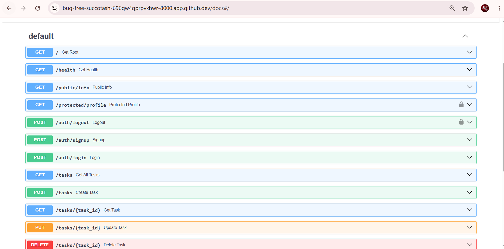

# 🔒 Assignment 4: Secure FastAPI Auth API (Supabase)

A secure, production-ready RESTful API built with Python and FastAPI. This stage introduces a robust authentication layer using Supabase to manage user accounts, hash passwords, and issue JSON Web Tokens (JWTs).

## 📌 Security Architecture
* **Identity Provider (IdP):** Supabase handles sign-ups, logins, and securely signs JWTs.
* **Stateless Auth Guard:** FastAPI's `Depends` (Dependency Injection) and `HTTPBearer` are used to extract and mathematically verify the JWT before granting access to protected routes.
* **Automated Swagger Security:** The API documentation includes a global security scheme (Padlock 🔒), allowing users to authenticate once and automatically send the `Bearer` token with all subsequent protected requests.

## ⚙️ Setup & Environment Variables
To run this project, you need a free Supabase project. Create a `.env` file in the root directory (ensure it is git-ignored) using the provided `.env.example` as a template:
```text
SUPABASE_URL=your_project_url_here
SUPABASE_KEY=your_anon_key_here 
```
## 🚀 How to Run Locally 
Start the application using Docker (from Assignment 3) or directly via Uvicorn:

# Using Docker:
docker compose up --build

# Using Uvicorn directly:
uvicorn main:app --reload

## 📋 Authentication & API Endpoints Specification
| Method | Endpoint | Purpose | Auth Required |
| :--- | :--- | :--- | :--- |
| **POST** | `/auth/signup` | Create a new user account | No |
| **POST** | `/auth/login` | Authenticate & return a JWT | No |
| **POST** | `/auth/logout` | End the user's session | Yes (Bearer) |
| **GET** | `/protected/profile` | Read private profile data | Yes (Bearer) |
| **GET** | `/public/info` | Read public, open data | No |

## 📸 Visual Documentation


# 🕰️ Past Implementations (History)

## 🚀 Assignment 3: PostgreSQL & Docker Migration
A persistent, production-ready RESTful Task Management API built with Python, FastAPI, and PostgreSQL running in a Docker container.

### 📌 Architectural Evolution Proof
I successfully replaced the SQLite repository with a PostgreSQL repository (`PostgresTaskRepository`). As required, my service logic and API routes in `main.py` remained completely unchanged during this swap. The architecture proves that swapping the storage layer only requires changing the repository implementation.

* **Database Setup:** PostgreSQL is running in a Docker container alongside the FastAPI web application using `docker-compose.yml`.
* **Connection Management:** The connection string is securely loaded from a `.env` file (which is gitignored). A `.env.example` file is committed to the repository for reference.

### 💾 Persistence Proof
I proved data persistence across restarts by performing these steps:
1. Created a new task via the Swagger API (`POST /tasks`).
2. Verified the task was saved (`GET /tasks`).
3. Stopped and removed the application and database containers using `docker compose down`.
4. Restarted the entire stack using `docker compose up -d`.
5. Sent another `GET /tasks` request and successfully retrieved the exact same task. The data survived the container restart because of the configured Docker volume (`postgres_data`).

---

## FastAPI To-Do CRUD API (In-Memory to SQLite Migration)
A persistent, production-ready RESTful Task Management API built with Python, FastAPI, and SQLite. Originally developed as an in-memory prototype, this project demonstrates the architectural evolution from ephemeral RAM storage to disk-persisted relational database management using raw SQL.

### 🛠️ Tech Stack
* **Framework:** FastAPI
* **Web Server:** Uvicorn (ASGI)
* **Data Validation & Serialization:** Pydantic
* **Persistence Layer:** SQLite (`tasks.db`) via Python's built-in `sqlite3`
* **Lifecycle Management:** Python `@asynccontextmanager` Lifespan Protocol

### 📌 Architectural Evolution: In-Memory vs SQLite

#### 1. Stage 1 (In-Memory Prototype)
* **Storage:** Python heap memory (`list` of dictionaries).
* **The Mortality Experiment:** Restarting the Uvicorn server cleared runtime RAM, resetting tasks back to the default seed list. This demonstrated the need for durable persistence.

#### 2. Stage 2 (SQLite Database Persistence)
* **Why SQLite?**
  * **Zero Configuration:** Serverless architecture requiring no external daemon or background service.
  * **Single-File Portability:** All relational data, indexes, and schema definitions live entirely within `tasks.db`.
  * **ACID Compliant:** Supports transactional integrity and standard SQL operations (`SELECT`, `INSERT`, `UPDATE`, `DELETE`).
* **Storage Location:** Stored at the project root (`tasks.db`).
* **Auto-Initialization:** Handled via FastAPI's asynchronous `lifespan` handler. On the very first server boot, it automatically defines the table schema and seeds initial records if the database is unpopulated.